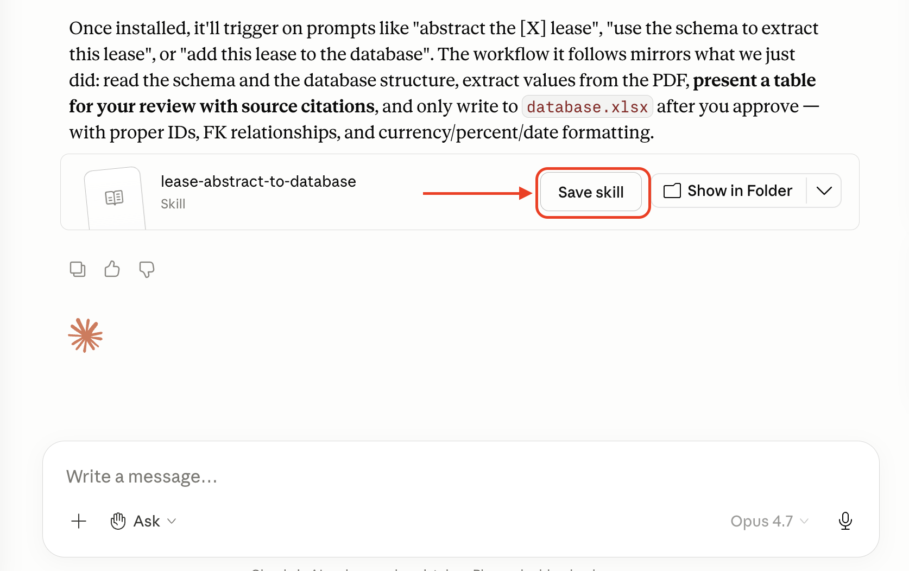

# Exercise 2: Extracting Complex Structured Data with a Lease Abstract
One of the most common questions we get at Beehive Advisors: how do we accurately extract structured data from documents? 

First, you need to point the AI to the document. Second, you must define three things in your prompt: 
1) The data's name
2) A description of the data and where to find it in the document
3) The data output format (aka, the data "type")

The best way to organize this is in a table. Let's say we wanted to extract the tenant:
| Field | Description | Type |
|---|---|---|
| tenant | Name of the tenant's organization  | string |

## Exercise 2.1: creating a data "schema" 
A schema is the formal definition of how data is structured. Let's define the data we wish to extract using [schema.xlsx](./schema.xlsx).

Open the Excel file and fill in the field definitions and types. All the cells you need to populate are highlighted in green. 

## Exercise 2.2: upload the lease & schema to cowork and execute your first abstract
Point your schema and the lease inside this directory to Claude. Create a prompt that asks Claude to abstract the Ironhide lease using the schema you provided. Ask Claude to return its answer in a table. 

## Exercise 2.3: write your data to our Excel "database" 
First, inspect the file named [database.xlsx](./database.xlsx). The Excel worksheet is our fictional database, and the tabs represent the different tables within the database. 

Ask Claude to write the abstracted lease to our Excel database. 

## Exercise 2.4: create an agent skill
Agent skills are just text files that describe a action or set of actions you wish to execute at once.

No sense in explaining more - let's make one together. Ask Claude to use your conversation history & to ask any outstanding questions to you, the user. 

## Exercise 2.5: Save the agent skill to Claude Cowork
Once you've reviewed the agent skill, click "Save Skill:"

This allows you evoke the agent skill using slash (`/`) notation within the Claude interface. 

To view your saved skill, go to Customize > Skills > Personal Skills > `YOUR-SKILL-Name`

We'll use `/` noation in our next exercise (`3-automation-with-agent-skills`). 