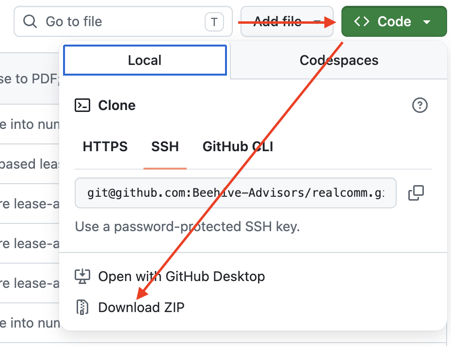

# Demo: Claude for CRE Automation

To download this repo, either clone it from your command line or use the "Download ZIP" button on Github:

This repository contains all of the files needed for our session today. The repo is broken into a folder for each step of the exercise with Claude:
1) Image search
2) Extracting structured data
3) Automating a pipeline with a skill 
4) Data entry with Claude in Chrome
5) Automating the data entry pipeline

## How to use this repo
Each numbered folder is a self-contained exercise with its own `README.md` that walks you through how to operate it, so work through them in order since later exercises build on what you produced earlier. Whenever you start an exercise, point Cowork at that specific subfolder (via "work in a project") rather than the repository root, so Claude only sees the files for the exercise you're on.
