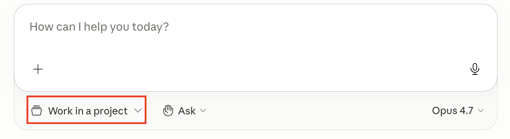
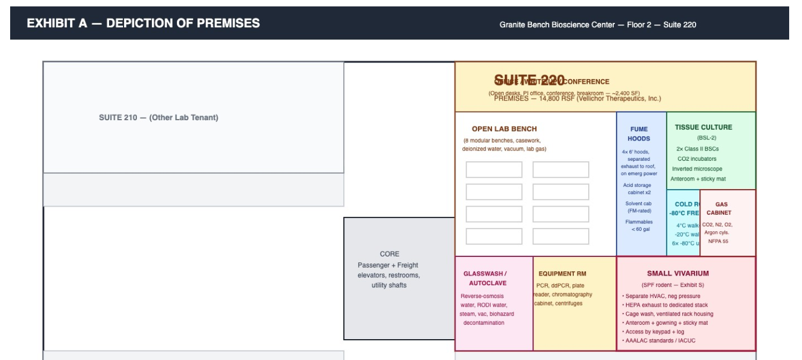

# Exercise 1: Lease Querying with Claude
In this exercise, you will learn how to search across a corpus of documents using both visual and textual search. 
## Exercise 1.1: open a few of the PDF leases & familiarize yourself
We can't work with data we don't have a feel for. Open a few of the leases and familarize yourself with the contents; notice the visuals on the appendicies. 

## Exercise 1.2: instantly create a lease database by navigating to the directory in Cowork
To select what file you'd like cowork to use during this exercise, select "work in a project" and choose the correct directory, which is named "1 - image searching". The button should look like this:

## Exercise 1.3: query the textual content of the leases
Let's start with a simple query against our lease database. You're welcome to 

## Exercise 1.4: query the visual content of the leases
Vellichor Theraputics has an appendix section with a floorplan that looks like this: 

This information is hard for the LLM to interpret textually. Ask a question about this visual, and make sure to tell Claude to use "visual search." This will ensure that the PDF page is converted to an image, which will allow the LLM to understand the visual information

## Exercise 1.5: query the documents then search the internet
Asking Claude to use "web search" will force it to use a  search engine to find real-time information.

Let's ask a question that asks Claude to find out: 
1) The industry of our 10 tenants
2) Use web search to find out which of the industries has the highest risk of being disrupted by AI. 

